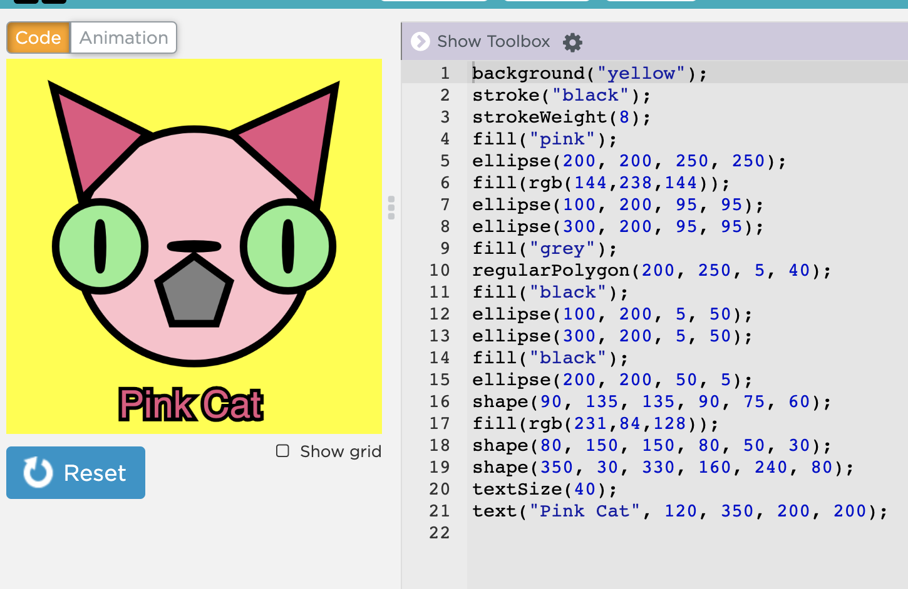

## Collaboartion Technique

### Peer Feedback

This collaborative activity can be done after
the programming assignments have been turned in.

### Guidelines
* Each group is given one or more student assignments, name(s) removed, to evaluate
according to the assignmnet's given criteria. 

* Your job is to write a paragraph on the strengths and weaknesses of each program to be 
presented to the entire class. 

### Why this collaborative technique is importnat?
 * The entire class can observe possibly different ways to complete an assignment.
 * They may discover that one way is more efficient or more elegant than another.

### Project: design and Code a robot
### [Project Guidlines](https://docs.google.com/document/d/1pN63jMrarXoR2qQba6RG8WnbswZBAZ-hucnyrSlzhZ4/edit?usp=sharing)
### Sample project

